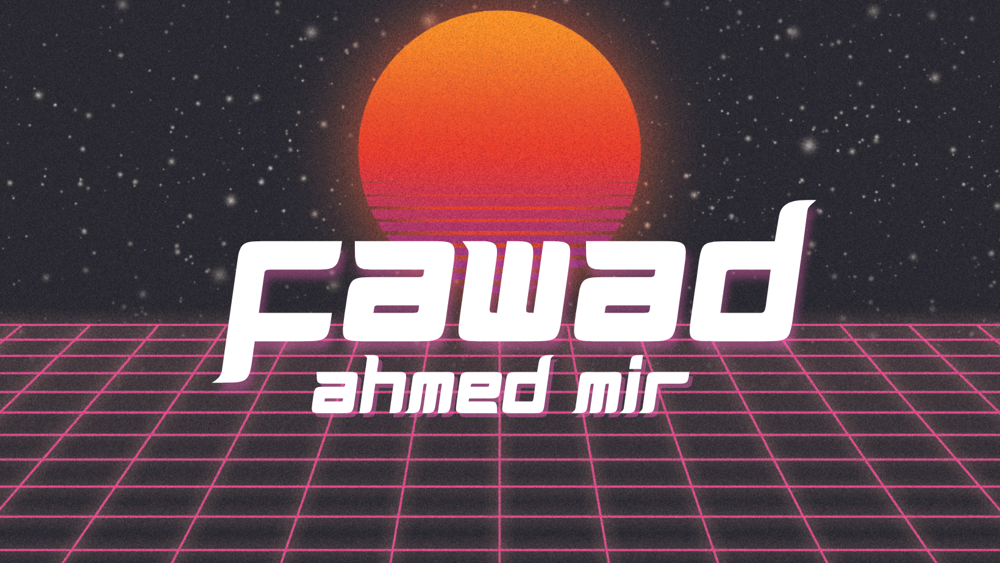

  

 

<h1>
 About Me 
<a href="#--about-me--">

</h1>

 &nbsp;  

                                               
- 🌱 I’m currently learning **Cybersecurity**    

- 💬 Ask me about **C++/Python**

- 📫 How to reach me **notfawadmir@gmail.com**

- ⚡ Fun fact **I Love Cats 🐈**

  ## 💼 Featured Projects & Contributions

Here are some of my standout projects and contributions that showcase my skills in AI, C++, Python development, cybersecurity, and more:

### 1. [**Bus Reservation System**](https://github.com/notfawadmir/Bus-Reservation-System) 
A project designed to manage bus reservations efficiently. It allows users to book tickets, view bus schedules, and manage passenger information. This system demonstrates object-oriented programming techniques, making it a valuable resource for learning structured application development.

### 2. [**Mental Health Analysis**](https://github.com/notfawadmir/ML-Mental-Health-Analysis)
A machine learning project aimed at analyzing mental health data to identify patterns and trends. This repository uses datasets and ML algorithms to provide insights into mental health issues, helping to create awareness and potentially aiding in decision-making for better mental health solutions.

 

### 3. [**Virtual Assistant OOP**](https://github.com/notfawadmir/OOP-Virtual-Assistant)
An object-oriented programming project for creating a virtual assistant. This assistant automates tasks such as fetching information, managing schedules, and responding to user queries. The repository demonstrates the application of OOP principles, showcasing modularity, inheritance, and encapsulation in building an interactive and efficient virtual assistant system.

 

### 4. [**File-Folder Checker**](https://github.com/notfawadmir/File-Folder-Checker)
A Shell Script designed to analyze and verify file and folder structures. This script helps in identifying Files or Folders' existence and tells us if a directory is empty or not and if the file is empty or not.

<h1> My Skill Sets  </h1>

### Languages
<table>
    <td align="center" width="90">
        
         <h4>Python</h4>
    </td>
    <td align="center" width="90">
        
         <h4>C++</h4>
    </td>
</table>

### Front End
<table>
<td align="center" width="90">
        
         <h4>HTML</h4>
    </td>
<td align="center" width="90">
        
         <h4>CSS</h4>
    </td>
</table>

### ML/DL
<table>
    <td align="center" width="90">
        
         <h4>Numpy</h4>
    </td>
    <td align="center" width="90">
        
         <h4>Pandas</h4>
    </td>
    <td align="center" width="90">
        
         <h4>Matplotlib</h4>
    </td>
    <td align="center" width="90">
        
         <h4>Seaborn</h4>
    </td>
    <td align="center" width="90">
        
         <h4>TensorFlow</h4>
    </td>
    <td align="center" width="90">
        
         <h4>Pytorch</h4>
    </td>
   <td align="center" width="90">
        
         <h4>Scikit-learn</h4>
    </td>
    <td align="center" width="90">
        
         <h4>Requests</h4>
    </td>
    <td align="center" width="90">
        
         <h4>Selenium</h4>
    </td>
</table>

### Tools
<table>
   <td align="center" width="90">
        
         <h4>GitHub</h4>
    </td>
    <td align="center" width="90">
        
         <h4>Jupyter</h4>
    </td>
    <td align="center" width="90">
        
         <h4>Anaconda</h4>
    </td>
    <td align="center" width="90">
        
         <h4>VScode</h4>
    </td>
    <td align="center" width="90">
        
         <h4>Linux</h4>
    </td>
    <td align="center" width="90">
        
         <h4>Kaggle</h4>
    </td>
    <td align="center" width="90">
        
         <h4>Bash</h4>
    </td>
</table>

## 📥 Download My CV:

  

 
## 📊 GitHub Stats

   

## 🛠️ Contribution Activity

    
     
    

## 🤝 Get in Touch:

  
  
  
  
  

  

