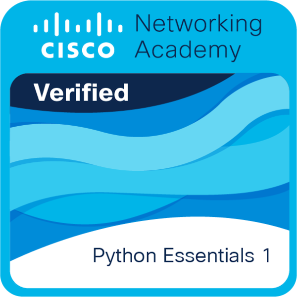

<!-- ============================================================ -->
<!--                  ANIMATED CYBER HEADER                      -->
<!-- ============================================================ -->

<div align="center">


</div>

<!-- ============================================================ -->
<!--                    TYPING ANIMATION                          -->
<!-- ============================================================ -->

<div align="center">

[](https://git.io/typing-svg)

</div>

<br/>

<!-- ============================================================ -->
<!--                  PROFILE STATS BAR                          -->
<!-- ============================================================ -->

<div align="center">

[](https://www.linkedin.com/in/fawad-ahmed-mir/)


</div>

---

<!-- ============================================================ -->
<!--                    ABOUT ME SECTION                         -->
<!-- ============================================================ -->

## `> whoami`


```bash
┌──(fawad㉿kali)-[~]
└─$ cat about.txt

  [*] Role      : Penetration Tester & Security Researcher
  [*] Focus     : Offensive Security, Malware Analysis, CTFs
  [*] Languages : Python | C++ | JavaScript | MySQL | Bash
  [*] Learning  : Advanced Cybersecurity & Red Teaming
  [*] Ask me    : C++ / Python / Web App Pentesting
  [*] Contact   : fawadmeer000@gmail.com
  [*] Fun fact  : I Love Cats 🐈 & Breaking Things Legally
```

<br clear="right"/>

---

<!-- ============================================================ -->
<!--                    FEATURED PROJECTS                        -->
<!-- ============================================================ -->

## `> ls -la ./projects/`

<br/>

<div align="center">

<a href="https://github.com/notfawadmir/Scanibal">

</a>
&nbsp;
<a href="https://github.com/notfawadmir/WebHawk">

</a>

<br/><br/>

<a href="https://github.com/notfawadmir/Ransomeware">

</a>
&nbsp;
<a href="https://github.com/notfawadmir/Keylogger">

</a>

</div>

<br/>

> 🟢 **Green** = Recon & Web Tools &nbsp;|&nbsp; 🔴 **Red** = Malware Research *(strictly educational — for understanding threats & building defenses)*

---

<!-- ============================================================ -->
<!--                   SKILLS & TOOLS                           -->
<!-- ============================================================ -->

## `> cat skills.cfg`

<br/>

### 🗣️ Languages

<div align="center">


</div>

---

### 🎨 Front End

<div align="center">


</div>

---

### 🤖 ML / Data Science

<div align="center">


</div>

---

### 🔴 Offensive Security & Pentesting Tools

<div align="center">


</div>

---

### 🖥️ Operating Systems & Lab Environments

<div align="center">


-E60026?style=for-the-badge&logo=windows&logoColor=white)


</div>

---

<!-- ============================================================ -->
<!--                   GITHUB STATS                              -->
<!-- NOTE: Uses correct param names — bg_color not background    -->
<!-- ============================================================ -->

## `> ./stats --user notfawadmir`

<br/>

<div align="center">


&nbsp;


</div>

<div align="center">


</div>

---

<!-- ============================================================ -->
<!--                  ACTIVITY GRAPH                             -->
<!-- ============================================================ -->

## `> git log --all --graph`

<div align="center">


</div>

---

<!-- ============================================================ -->
<!--                CONTRIBUTION SUMMARY                         -->
<!-- ============================================================ -->

## `> analyze --contributions`

<div align="center">


</div>

---

<!-- ============================================================ -->
<!--                CERTIFICATIONS & BADGES                      -->
<!-- ============================================================ -->

## `> ls ./certs/`

<div align="center">

<a href="https://www.credly.com/badges/e79e2be1-d5cc-4cf2-b54f-2c1f1a781bdb/public_url" target="_blank">
  
</a>
&nbsp;&nbsp;&nbsp;
<a href="https://www.credly.com/badges/3e96d751-81b0-47ce-8a32-d327d8cf0315/public_url" target="_blank">
  
</a>

</div>

---

## `> download CV`

<div align="center">

<a href="./assets/CV.pdf" download="Fawad_Ahmed_Mir_CV.pdf">
  
</a>

</div>

---

<!-- ============================================================ -->
<!--                    CONTACT SECTION                          -->
<!-- ============================================================ -->

## `> ./connect --target fawad`

<div align="center">

[](https://www.linkedin.com/in/fawad-ahmed-mir)
[](mailto:fawadmeer000@gmail.com)
[](https://instagram.com/notfawadmir)
[](https://www.threads.net/@notfawadmir)
[](https://www.facebook.com/fawad.mir.2025)
[](https://wa.me/923065297526)
[](https://medium.com/@fawadmeer000)

</div>

---

<!-- ============================================================ -->
<!--                    ANIMATED FOOTER                          -->
<!-- ============================================================ -->

<div align="center">


</div>

<div align="center">

```
[ ALL SYSTEMS OPERATIONAL ] [ STAY ETHICAL ] [ HACK THE PLANET ]
```

</div>
